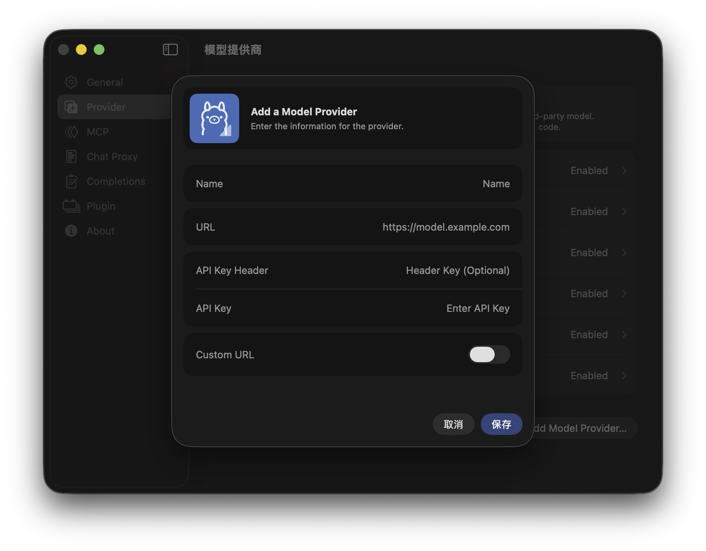

# How to Add a Model Provider

A model provider is a service, such as OpenRouter or Alibaba Model Studio, that offers an API to access online LLM models.  
Since Xcode only integrates ChatGPT and Claude, other models like Gemini, Qwen, DeepSeek, and Kimi-K2 can work with XcodePaI as the AI agent for your Xcode project.  
The setup process is straightforward.

## 1. Open `XcodePaI` Settings and Navigate to the `Provider` Section

    

## 2. Click `Add Model Provider` to Open the Configuration Window

    

## 3. Configure Your Model Provider Details

### Name and Icon

You must assign a name to the configuration. You may also choose an icon for the provider.

### URL

The provider's URL can be found on your model provider's console page.  

XcodePaI only supports providers with OpenAI-compatible interfaces. Fortunately, most providers support this standard.  
**Note:** Do not include `/v1/completions` at the end of the URL.  

    

### API Key

Most providers supply a private API key (typically starting with `sk-`) after registration.  
Enter this key in the `API Key` section.  

    

While most providers use the `Authorization` header for API key verification, some may use a different header name.  
If needed, specify the custom header key in the `API Key Header` section.

### Custom URL

If your provider uses non-standard API paths, enable Custom URL to configure these endpoints separately:  

- `Model URL` – Interface for fetching the model list  
- `Chat URL` – Interface for chat completions  
- `Completion URL` – Interface for text completions  

    

After completing the configuration, click `Save` to store your settings.

## 4. Update the Model List

Select your model provider from the list to open its detail page.  

    

The header includes two buttons and one toggle switch:

- **Refresh button** – Calls `/v1/models` (or your custom model interface) to update the available models. Use this when first adding a provider.
- **Edit button** – Allows you to modify the provider's configuration.
- **Enable switch** – Activates or deactivates the provider. Disabled providers cannot be used in ChatProxy or Code Completion.

The list below displays all LLM models available from this provider.  
If the provider does not support model listing, you can manually add models using the add button at the bottom of the list.

Each model can be tested for functionality.  
You can enable or disable individual models—disabled models will not be available in ChatProxy or Code Completion.

## 5. Ready to Go

Your models are now available for use in XcodePaI.

    

