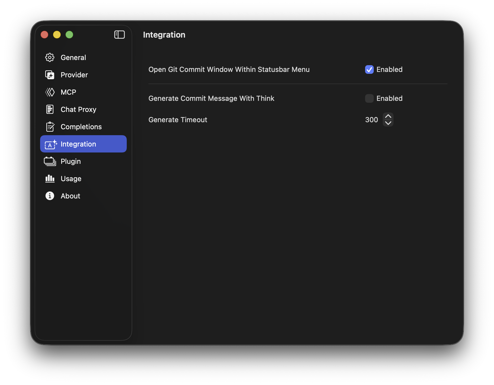
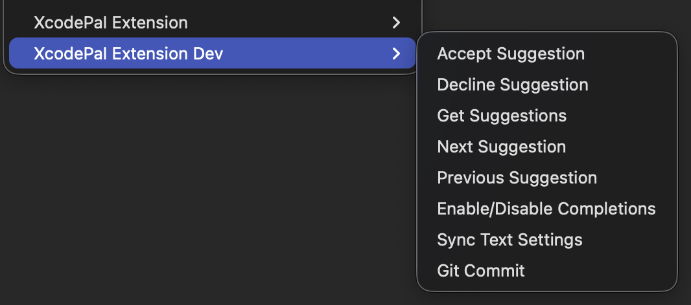
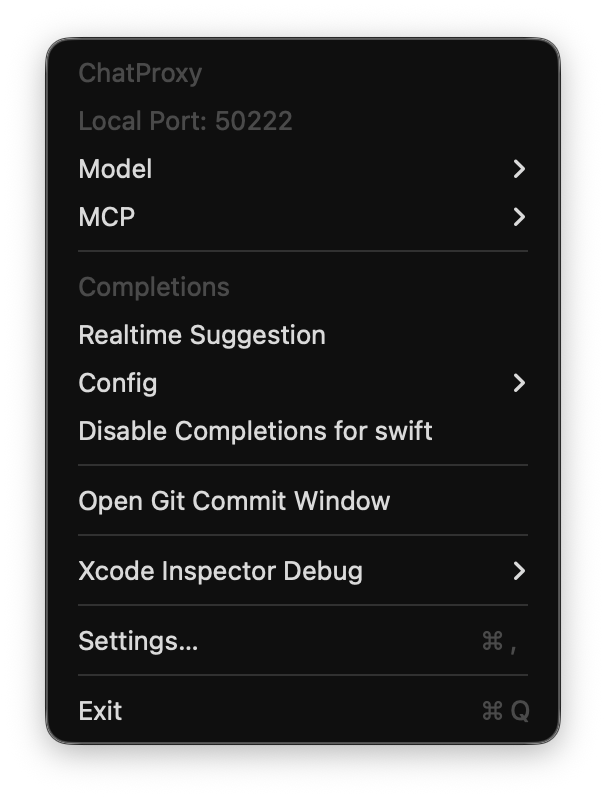
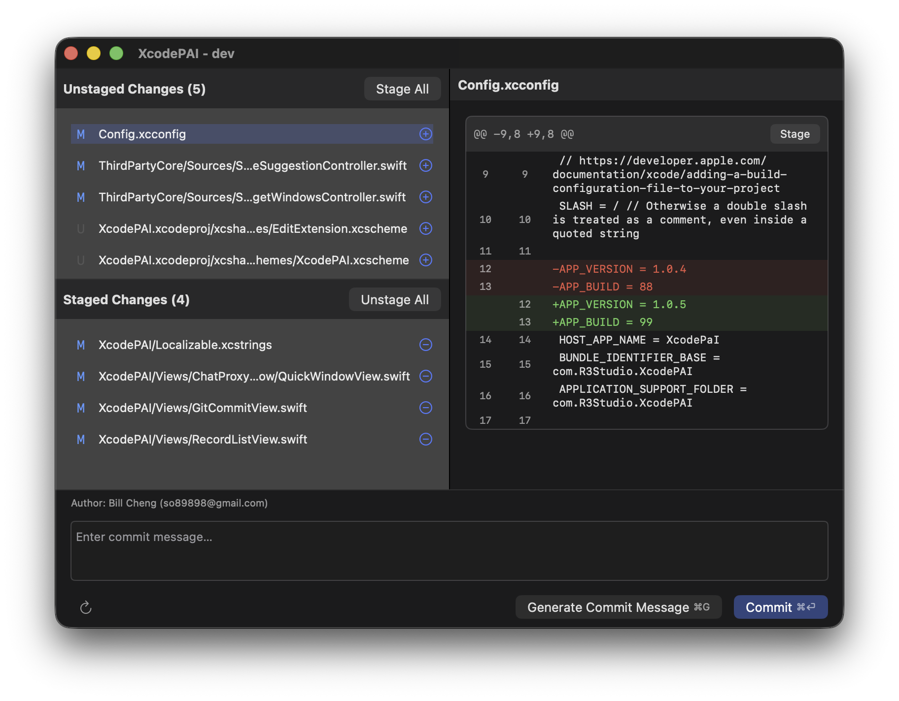
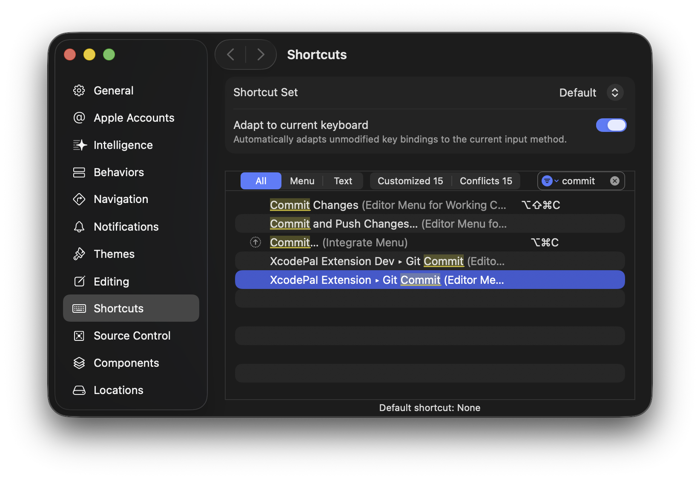

# How to Generate Git Commit Messages

With Git integration in your project, XcodePaI can use AI models to help generate commit messages by analyzing your code changes.

## Setting up Git Integration

Open `XcodePaI` Settings and navigate to the `Integration` section.

    

Since Git integration uses the same model as ChatProxy, you do not need to reconfigure the model or model provider if you already use a model for ChatProxy.

You can enable the Git commit entry in the status bar menu for quick access to Git commit for the current Xcode project. XcodePaI will automatically recognize the project details and Git information.

If your model supports reasoning, you can enable `Generate Commit Message With Think` to get more accurate commit messages for your code.

The `Generate Timeout` defines the timeout for the commit message generation request.

## Accessing the Git Commit Window

You can open the Git commit window in two ways:

    

Use the `XcodePaI Extension` menu in the Xcode Editor Menu.

    

Or use the `Open Git Commit Window` button in the XcodePaI status bar menu, if enabled in the integration configuration.

## Git Commit Window

    

The Git commit window displays the Git information of your current project in Xcode.

Staged and unstaged files are listed on the left side of the window. Click a file to view its diff changes on the right.

After staging files, you can write your own commit message and ask the model to improve it, or simply let the model generate a commit message based on your code changes.

You can then commit the changes with the generated or edited commit message.

If your code changes during generation, you can refresh the file state using the refresh button at the bottom left of the window.

## Tips

To open the Git commit window with a keyboard shortcut, open Xcode Settings and assign a key combination to the `XcodePaI Extension Git Commit` action.

    

