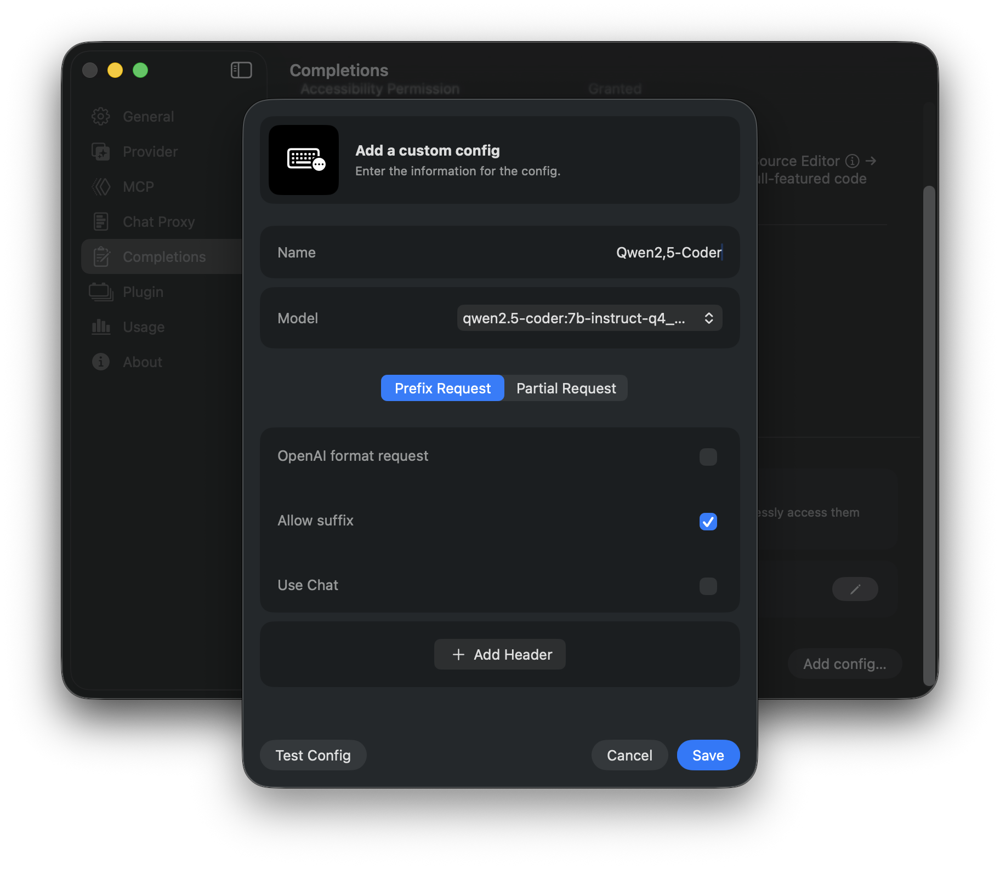
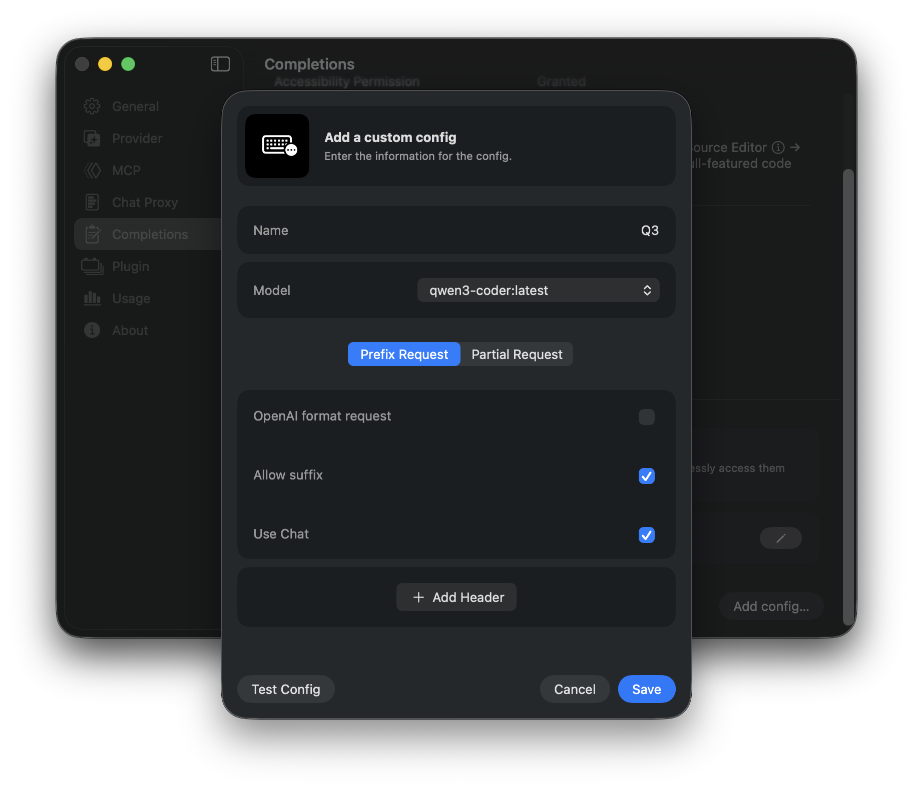
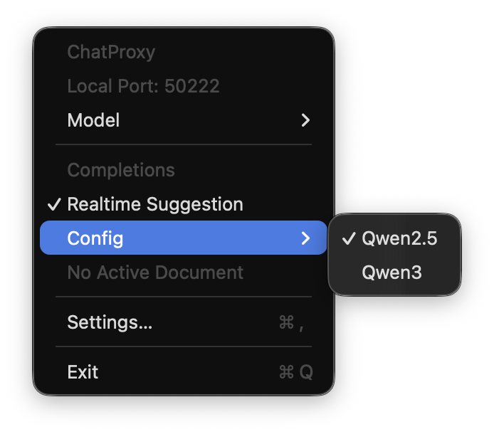

# How to Use a Model for Code Completion

XcodePaI supports using external LLM models to provide code completions while you edit source code. Multiple LLM models, such as Qwen3-Coder, Kimi-K2, and others, support this functionality.

While most LLM models and providers offer a completion service that can generate code until the end of the file, in practice, we typically only need to fill the gap between the current line and the following line. Therefore, the model must understand how to complete the code within this specific context.

## Request Formats

XcodePaI supports three methods for using an LLM model as a code completion service. This document explains how to configure each approach.

### 1. Using `/v1/completions`

Completion is a foundational technique for LLMs, and most models support it. However, not all model providers expose a `/v1/completions` endpoint. Please consult your provider's documentation to confirm its availability.

<p align="center">
    
</p>

The `/v1/completions` interface typically supports two body data formats.

#### OpenAI Format

The OpenAI format sends body data as follows:

```json
{
  "prompt": "{prefix_content}",
  "suffix": "{suffix_content}"
}
```

- **prompt**: The code before the current cursor.
- **suffix**: The code after the current cursor.

#### Basic Format (FIM)

The Basic format requires the LLM to support Fill-in-the-Middle (FIM). These models are trained with special tokens: `<|fim_prefix|>`, `<|fim_suffix|>`, and `<|fim_middle|>`.

The request body would look like this:
```json
{
  "prompt": "<|fim_prefix|>{prefix_content}<|fim_suffix|>{suffix_content}<|fim_middle|>"
}
```

Some providers, like Ollama, accept the OpenAI format and internally convert it to the FIM format for the model. Refer to your model provider's API documentation to see which body formats are supported.

If your chosen model can accept a `suffix` parameter, enable the `Allow suffix` switch for more accurate completions.

### 2. Using the Chat Interface

If your model provider does not offer a `/v1/completions` or similar API, you can use the chat interface for code completion instead.

<p align="center">
    
</p>

For example, the Qwen3-Coder model from Alibaba Model Studio cannot be accessed via `/v1/completions`, but you can configure it as shown in the screenshot.

With this configuration, XcodePaI will use the `/v1/chat/completions` endpoint with a built-in system prompt to instruct the LLM to generate code completions.

Models trained with FIM markers typically provide good responses. However, sufficiently powerful models can often generate usable completions even without explicit FIM training.

### 3. Using Chat with Partial Completion

Some model providers support a `partial` completion request, where the model attempts to continue the content directly after the user's input.

<p align="center">
    
</p>

The official Qwen3-Coder documentation mentions support for this method.

In this mode, XcodePaI sends a request to `/v1/chat/completions` with a custom system prompt that includes the code after the cursor. Occasionally, the model understands the intent and provides an accurate response, but results can be inconsistent.

## Header Configuration

Model providers may require specific headers for code completion requests, such as an API key or application version.

You typically do not need to re-enter the API key if it's already correctly set in the model provider's main configuration. However, you must add any other headers required by your specific provider.

## Testing Your Configuration

You can test your configuration before saving it. XcodePaI will send sample Swift code to the server and display the response in a popover.

## Using the Configuration in the Xcode Editor

Please refer to other documentation for instructions on setting up the code completion extension and the necessary permissions.

Finally, remember to select your desired configuration from the menu.

<p align="center">
    
</p>
