#  XcodePaI

  
  <h1>XcodePaI</h1>
  
The AI pair programmer for Xcode.

  
  
  
  
  
  

[XcodePaI](https://github.com/so898/XcodePaI)(/ɛksˈkoʊd pæl/) is an AI pair programmer
tool that enchance your Xcode AI function which helps you write code faster and smarter. XcodePaI is an Xcode extension that provides local proxy to enchange Xcode 26 coding assistant and inline coding suggestions as you type.

## ChatProxy

XcodePaI provide local proxy server for Xcode to regconize as local model provider. Multiple model provider with OpenAI API format could be proxy to Xcode coding assistant.

## Agent Mode

XcodePaI enhance Xcode coding assistant with Agent Mode provides AI-powered assistance that can understand and modify your codebase directly. With Agent Mode, you can:
- Get intelligent code edits applied directly to your files
- Search through your codebase to find relevant files and code snippets
- Create new files and directories as needed for your project
- Get assistance with enhanced context awareness across multiple files and folders
- Run Model Context Protocol (MCP) tools you configured to extend the capabilities

Agent Mode integrates with Xcode coding assistant's environment, creating a seamless development experience where assistant can help implement features, fix bugs, and refactor code with comprehensive understanding of your project inside Xcode.

## Code Completion

You can receive auto-complete type suggestions from any available model provider by starting to write the code you want to use, or by writing a natural language comment describing what you want the code to do.

OpenAI format `v1/completions` and `v1/chat/completions` endpionts with <b>partial</b> supported model could be use as your code suggestion/completion provider.

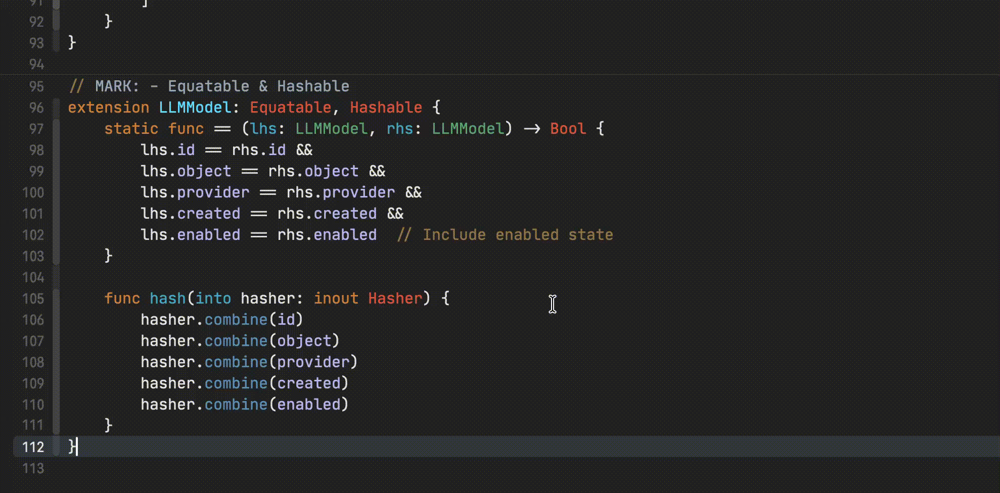

## Requirements

- macOS 15+
- Xcode 16+

## Getting Started

1. download the `zip` from
   [the latest release](https://github.com/so898/XcodePaI/releases/latest/).
   Unzip zip file, drag `XcodePaI.app` into the `Applications` folder.

1. Open the `XcodePaI` application (from the `Applications` folder). Accept the security warning.
   

     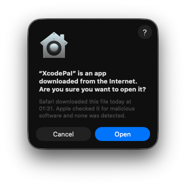
   

1. Open `XcodePaI` Settings -> Provider to add Model Provider.
   

    
   

   XcodePaI accept model provider such as Ollama/Alibaba Cloud/OpenRouter and other provider support OpenAI `v1` endpoint format.

1. Open model provider detail to sync models from service

1. *[Opiontal]* Open `XcodePaI` Settings -> MCP to add MCP service

   

    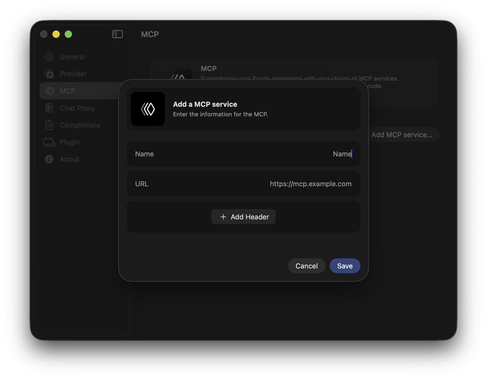
   

1. *[Opiontal]* Create custom model config

   

    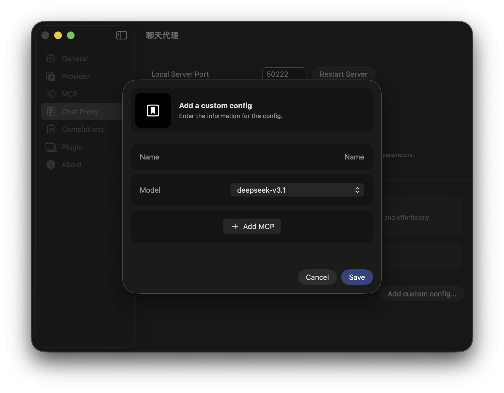
   

## How to use ChatProxy

   Open Intelligent in Xcode configuration window.
  - Open via the Xcode menu `Xcode -> Settings -> Intelligent`.
  

    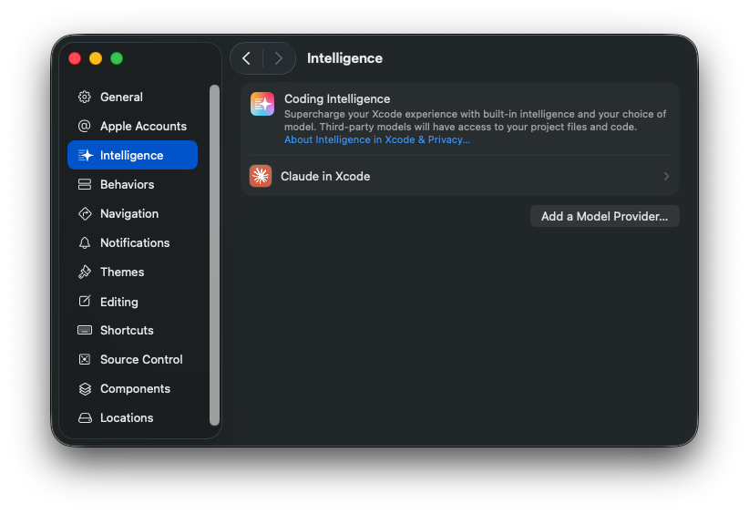
  

  - Add XcodePaI as Local Model Provider

  

    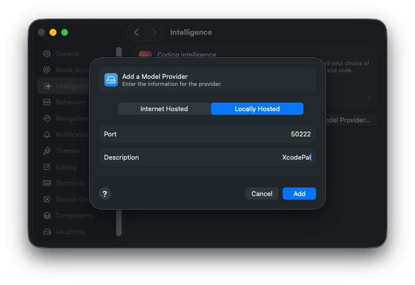
  

  - Check XcodePaI local model provider info

  

    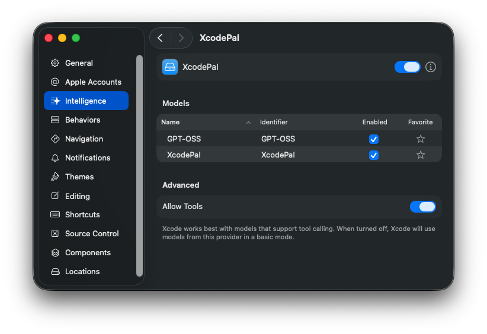
  

  - Create new chat via Xcode Code Assistant sidebar, and choose XcodePaI as the model provider.

  

    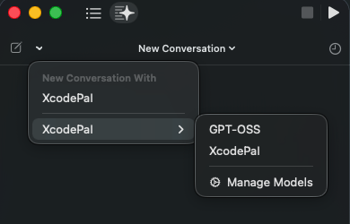
  

  - Via statusbar button menu, the model used in code assistant chat window could be change

  

    
  

## How to use Code Completion

Two permissions are required for XcodePaI to function code completions properly: `Accessibility`, and `Xcode Source Editor Extension`. For more details on why these permissions are required see [TROUBLESHOOTING.md](./TROUBLESHOOTING.md).

1. __The `Accessibility` permission__ can be requested via XcodePaI Settings -> Completions -> Accesibility Permission:

   

     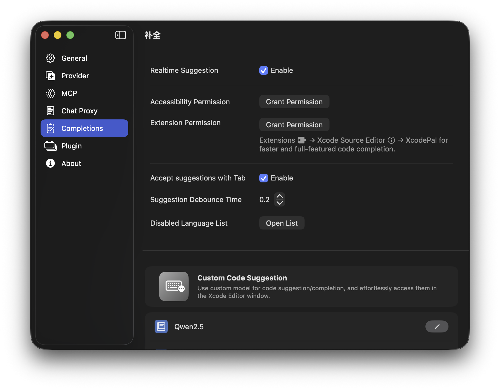
   

   Via Grant Permission button, XcodePaI will open permission request window for Accessibility permission.

   

     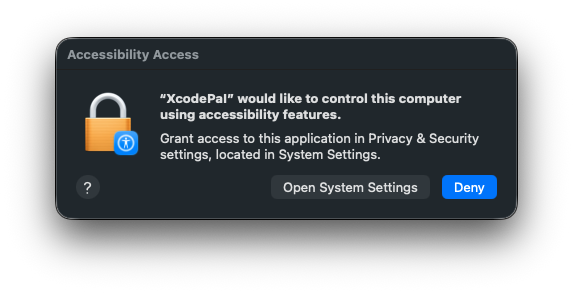
   

   The Accessibility permission could be granted in the System Preferences:

   

     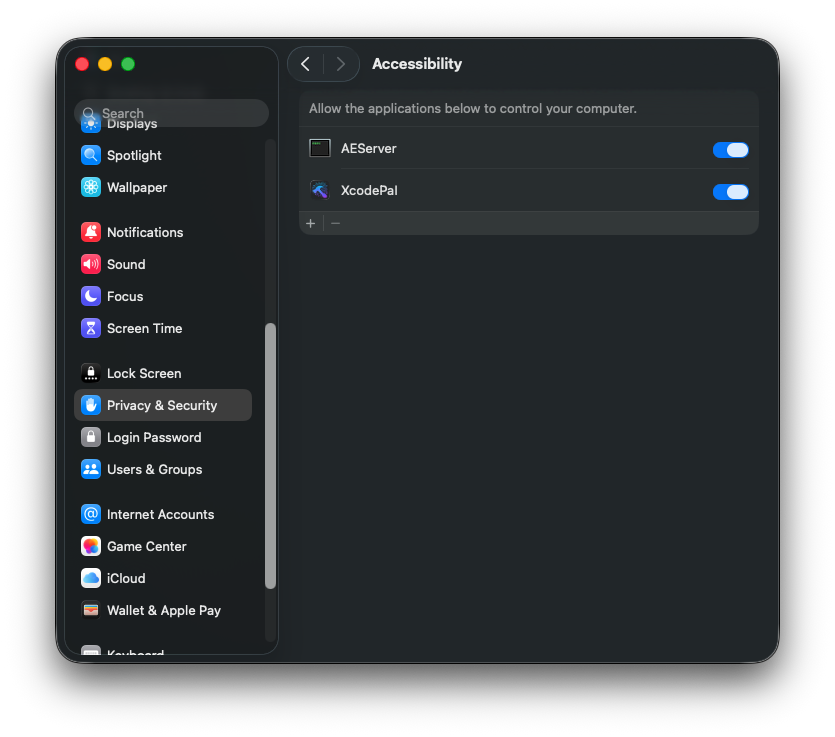
   

1. __The `Xcode Source Editor Extension` permission__ needs to be enabled manually. Click
   `Extension Permission` from the `XcodePaI` application completions settings to open the
   System Preferences to the `Extensions` panel. Select `Xcode Source Editor`
   and enable `XcodePaI`:

   

     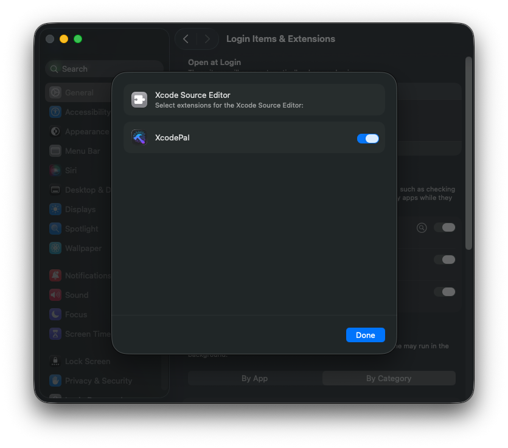
   

1. After granting the extension permission, open Xcode. Verify that the
   `XcodePaI` menu is available and enabled under the Xcode `Editor`
   menu.
     
    

      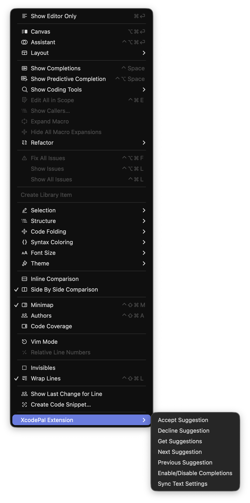
    

    Keyboard shortcuts can be set for all menu items in the `Key Bindings`
    section of Xcode preferences.

1. To enable `Xcode Source Editor Extension`, click `Sync Text Settings` in the menu.

     
    

      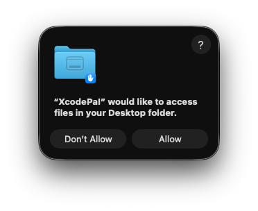
    

    Please grant any access permission for XcodePaI and XcodePaI Xcode Extension.

1. To avoid confusion, we recommend disabling `Predictive code completion` under
   `Xcode` > `Preferences` > `Text Editing` > `Editing`.

1. Press `tab` to accept the first line of a suggestion, hold `option` to view
   the full suggestion, and press `option` + `tab` to accept the full suggestion.

   Press `tab` to accept the first line of a suggestion, hold `option` to view
   the full suggestion, and press `option` + `tab` to accept the full suggestion.

## License

This project is licensed under the terms of the MIT open source license. Please
refer to [LICENSE.txt](./LICENSE.txt) for the full terms.

## Acknowledgements

Thank you to @intitni and @Github for creating the code completions method for Xcode that this project is based on.

Attributions can be found under About when running the app or in
[Credits.rtf](./Docs/Credits.rtf).